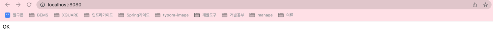

# 빈즈 토크 활용기

> 어플리케이션을 배포할때 고려해야 하는 용량 프로비저닝, 로드 밸런싱, 모니터링들을 직접 구축하여 시간을 낭비하기 보다는
> 빈즈토크를 이용해 어플리케이션을 업로드, 버전관리 할 수있는 기능을 가진 빈즈 토크를 사용해 보기로함.


## 서비스 배포를 어떻게 해야할까?

* 어떤 서버를 사용해야 할까?
    * EC2 컴퓨팅 자원에 직접 배포 해야 할까?
    * 컨테이너만 실행할까?
        * 오케스트레이션 도구를 사용해야 할까?
            * ECS를 사용해야 하나?
            * EKS를 사용해야 하나?
* 백앤드 개발자는 어플리케이션에만 집중하고 싶은데.... > BeansTalk 를 활용하면 좋다.

## 어플리케이션 구성
메인 접근식 OK를 출력해주는 웹 어플리케이션


도커를 이용해 Container 를 통한 배포 예정
```shell
docker build -t okweb .
docker run -p 8080:8080 okweb 
```

## CLI 사용법

> EB의 경우 배포 생성 등을 CLI 를 이용해서 진행하기 때문에 CLI를 설치 해줘야한다


### EB 활성화

```she
eb init
```

설정완료후 `.elasticbeanstalk/config.yml`

```yaml
branch-defaults:
  main:
    environment: null
    group_suffix: null
global:
  application_name: application-sample
  branch: null
  default_ec2_keyname: bems-keys
  default_platform: Docker running on 64bit Amazon Linux 2
  default_region: ap-northeast-2
  include_git_submodules: true
  instance_profile: null
  platform_name: null
  platform_version: null
  profile: eb-cli
  repository: null
  sc: git
  workspace_type: Application
```


## EB 생성

```shell
eb create [application-name]
```


* EB로 어플리케이션 구성 완료

